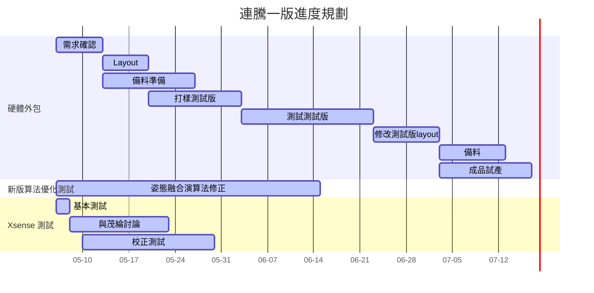

```mermaid
gantt
%% 宣告這是甘特圖
title 連騰一版進度規劃
	%% 給它一個標題
dateFormat  MM-DD
	%% 日期格式
	axisFormat  %m-%d
	%% 縱軸的日期格式
 
%% Datasheet
section 硬體外包
    
    需求確認: active, fix1, 05-06, 7d
    %% 確認所有的實驗，確認可以執行的實驗項目
    Layout : active, fix2, after fix1, 7d
    備料準備 : active, prepare1, after fix1, 14d
    %% 比對其他廠商的datasheet
    打樣測試版 : active, fix3, after fix2, 14d 
    %% 確認哪一些資料是不需用給的或是少給的
    測試測試版: active, fix4, after fix3, 20d 
    %% 進行資料上的確認，需要進行實驗
    修改測試版layout: active, fix5, after fix4, 10d 
    %% 將測試的數據填回datasheet    
    備料: active, fix6, after fix5, 10d 
    成品試產: active, fix6, after fix5, 14d     
 
%% Kado layout的版本規劃
section 新版算法優化測試
    
    %% 初版電路設計，後面放棄原因是無法拿到正確的gerber file
    姿態融合演算法修正:active, first1, 05-06, 40d
    %% 進行討論
    %% 台灣重新layout: done, first2, 02-15, 6d
    %% 與采鑫的來回溝通
    %% 洗板 : done, first3, after first2, 15d
    %% 要找庚霖進行上件
    %% 上件 : active, first4, after first3, 20d
    %% 測試實際功能
    %% 檢驗 : active, first5, after first4, 20d

section Xsense 測試
    
    %%檢查 mems 位置確認工作的完成情況，確保符合設計要求。
    基本測試 : active, new1, 05-06, 2d
    %%與緯創溝通，確認開發進度和任何必要的調整。
    與茂綸討論 : active, new2, after new1, 15d
    %%確保打樣工作按照預定計劃進行，並準備好進行下一步驗證。
    %%驗證過程中的結果，確認產品的性能和品質達到要求。
    校正測試 : active, new3, 05-10 , 20d
    %%問題修正
    %% 成品討論 : active, new4, after new3, 20d
        

```
